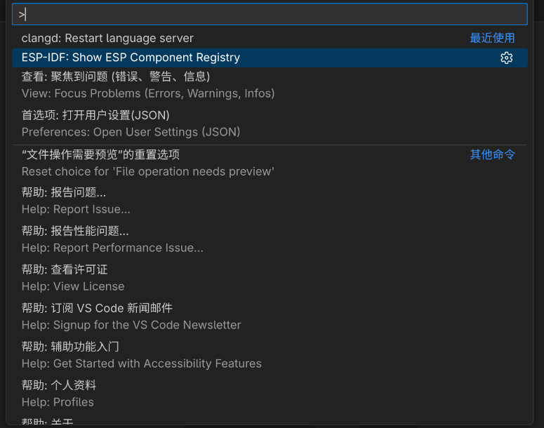
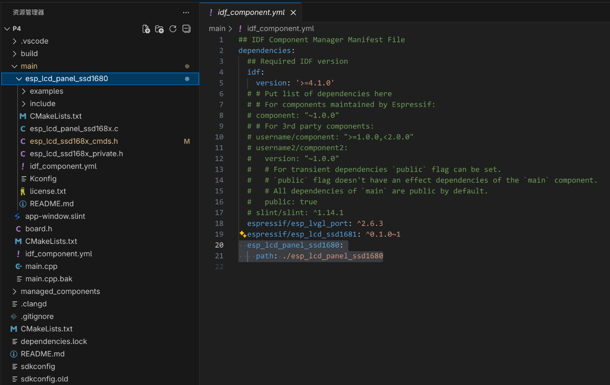

# 添加组件

- <https://docs.espressif.com/projects/esp-idf/zh_CN/stable/esp32/api-guides/tools/idf-component-manager.html>
- <https://docs.espressif.com/projects/esp-idf/zh_CN/stable/esp32/api-guides/build-system.html#component-requirements>

main 组件比较特别，因为它在构建过程中自动依赖所有其他组件。所以不需要向这个组件传递 REQUIRES 或 PRIV_REQUIRES

## 从乐鑫组件注册表安装

ctrl+shift+p

打开之后，选择需要的组件，点 install 安装

## 使用本地组件

以 main 组件直接需要的组件为例，在 main/idf_component.yml 中添加本地组件，不指定版本

> 不可以放在 managed_components 中，因为可能会被 clean

## 从 Git 仓库定义依赖关系

...
