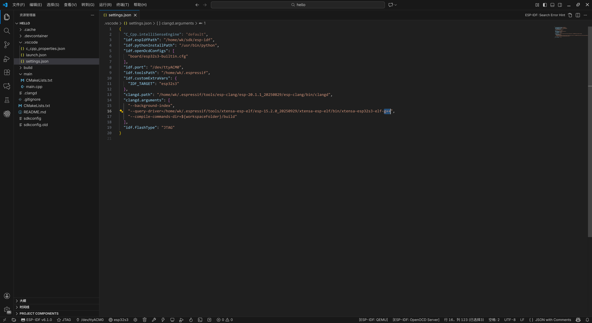
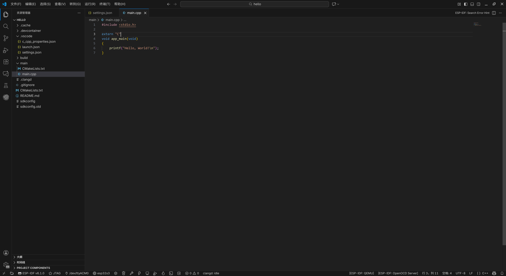
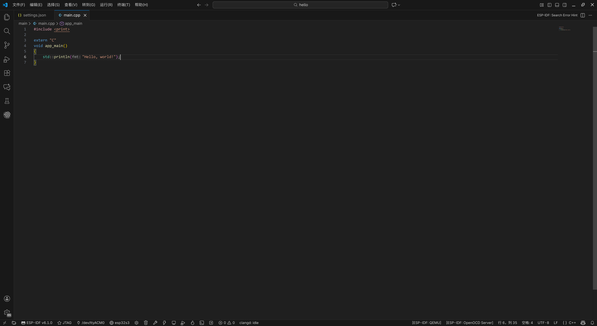

# 使用 C++ 开发

## 在 .vscode/settings.json 中修改 clangd 参数

将gcc修改为g++

> 可能需要重启clangd

## 修改 .c 为 .cpp，添加extern "C"

将 main.c 重命名为 main.cpp，在 app_main() 函数前添加 `extern "C"`

## 使用 C++ 的 [`<print>`](https://zh.cppreference.com/w/cpp/header/print.html)

