# VS Code 中安装 ESP-IDF 并创建项目

参考：<https://github.com/espressif/vscode-esp-idf-extension/blob/master/README_CN.md>

## 创建配置文件（可选）

左下角设置选择配置文件，新建。目的是隔离插件。

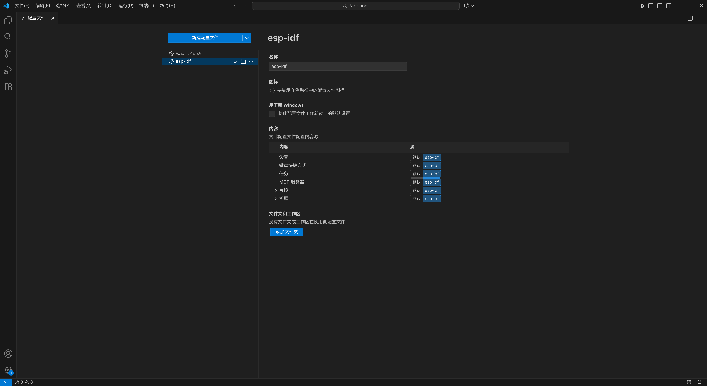

以后如果想使用ESP-IDF，可以在左下角选择idf的配置文件。

## 安装插件

- esp-idf 核心插件
- clangd 语言服务器

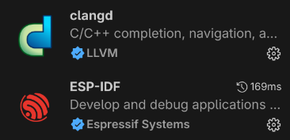

## 配置 esp-idf 插件

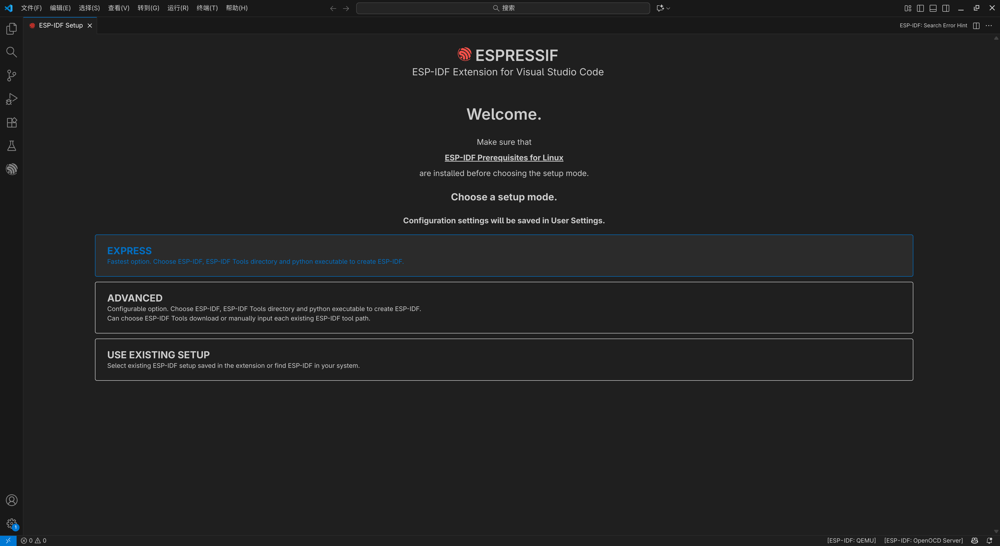
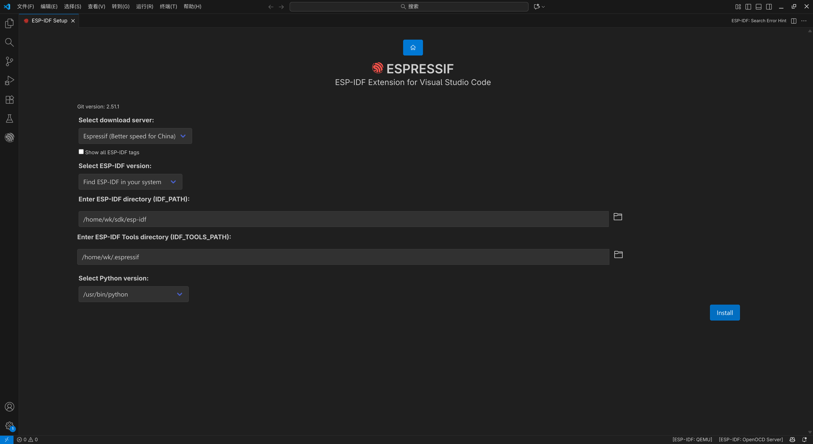

## 新建项目

以 template-app 模板（空模板）为例，目标和端口可以在创建好之后在下方设置：

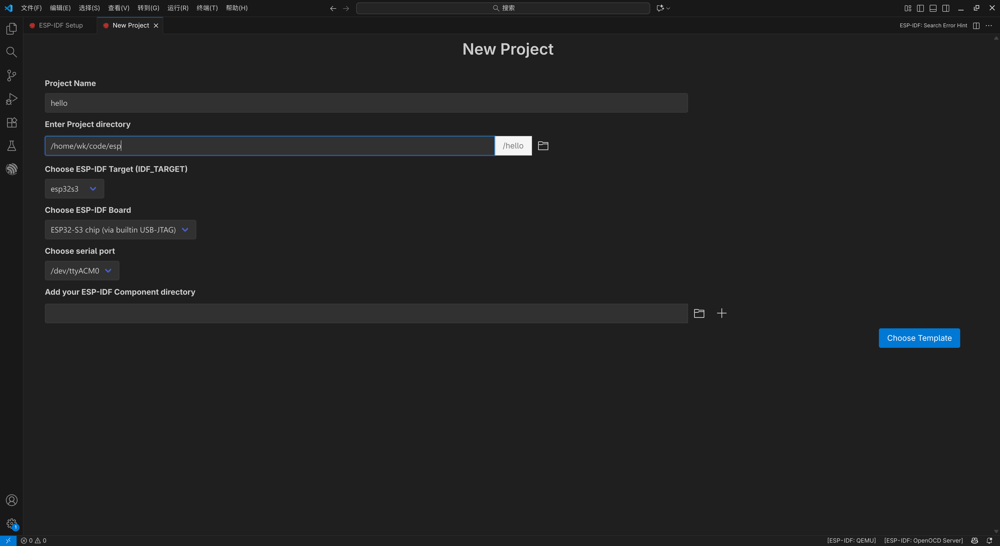
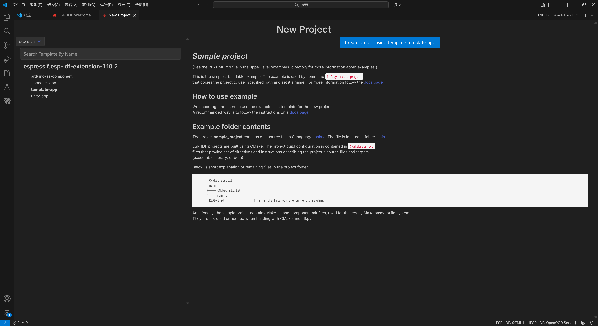

点击创建，右下角会弹出打开项目的弹窗，点击打开项目。

## 在 .vscode/settings.json 中修改 clangd 参数（只有 xtensa 架构的需要这样修改，未来 esp-idf 插件可能会完善）

将光标处修改为目标芯片的型号，以 esp32s3 为例

- 修改前：
    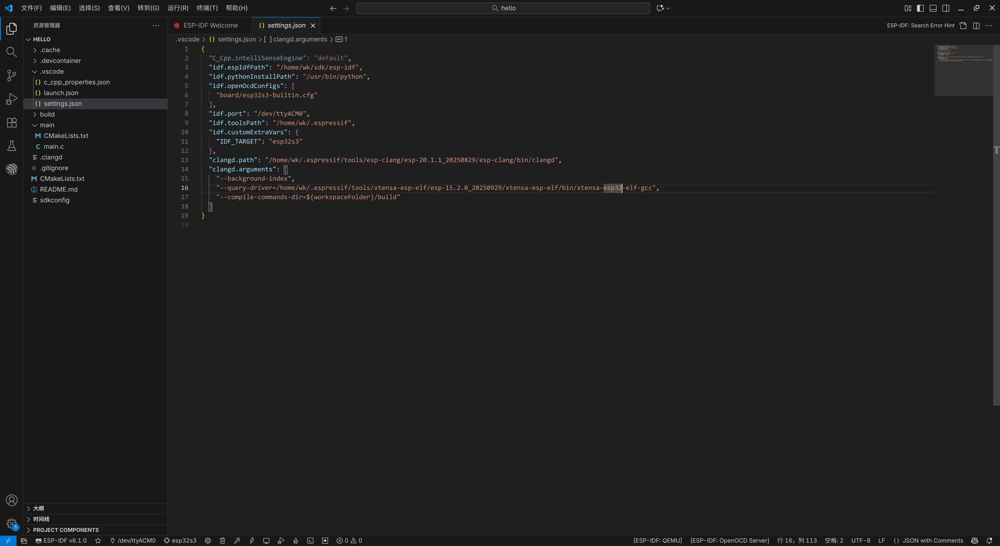
- 修改后：
    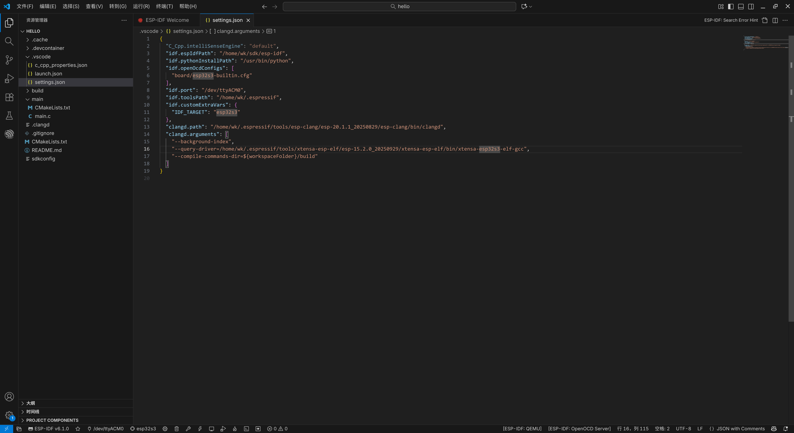

> 目的是保持与 ${workspaceFolder}/build/compile_commands.json 中的编译器一致，compile_commands.json文件在 cmake 配置完成（再次选择目标芯片或构建项目）后产生

## 通过 Menuconfig 配置 CPU 主频和 Flash 大小（可选）

- CPU 主频：
    
- Flash 大小：
    

点击 `Save` 保存。

## 编写代码、编译、烧录、监视和调试

- 编写代码，clangd 正常工作：
    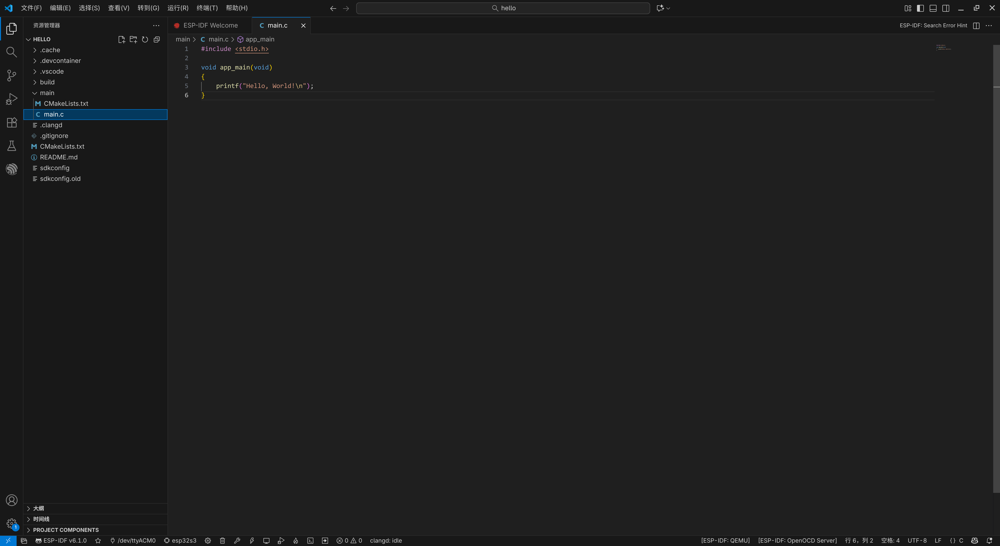
- 点击下方构建按钮：
    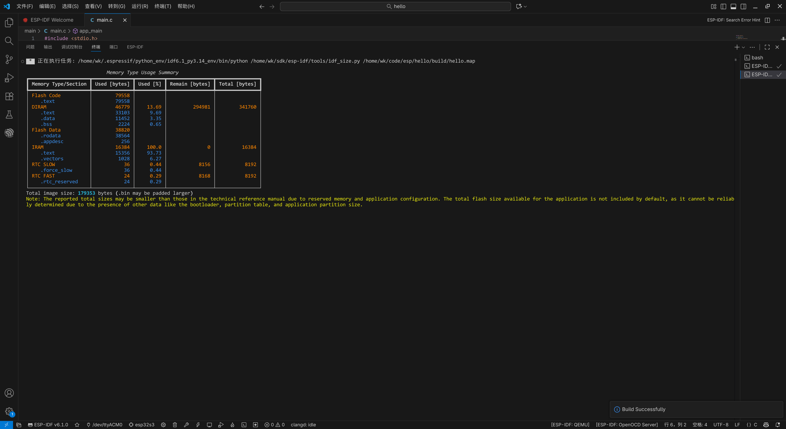
- 点击下方烧写按钮：
    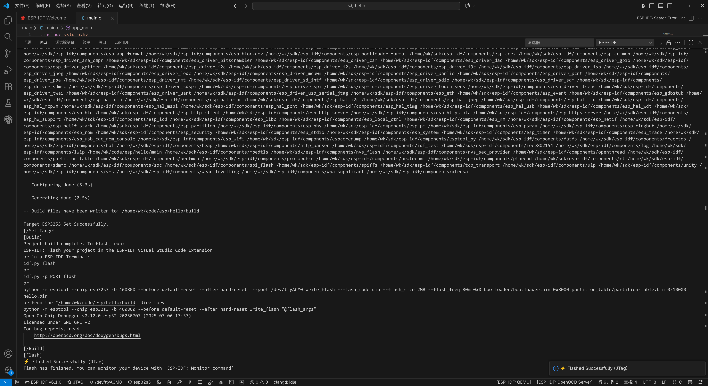
- 点击下方监视按钮，可使用 `Ctrl+]` 退出：
    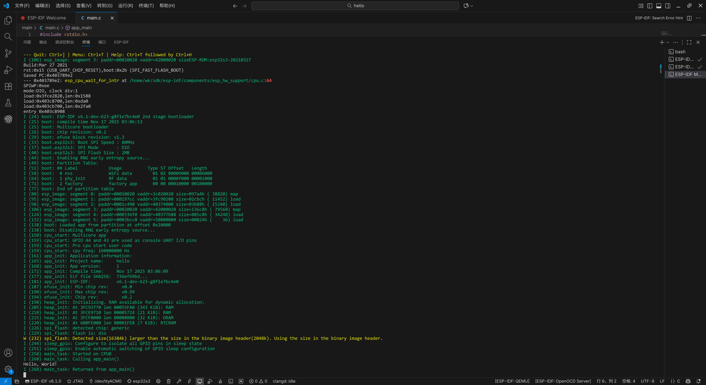
- 打断点，点击下方调试按钮：
    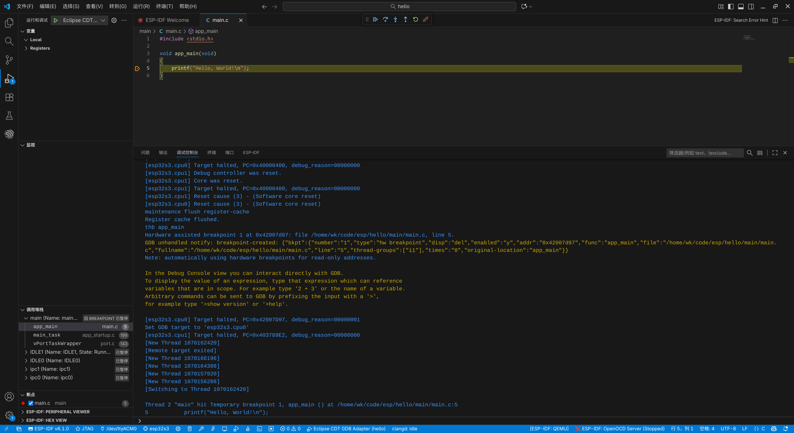
