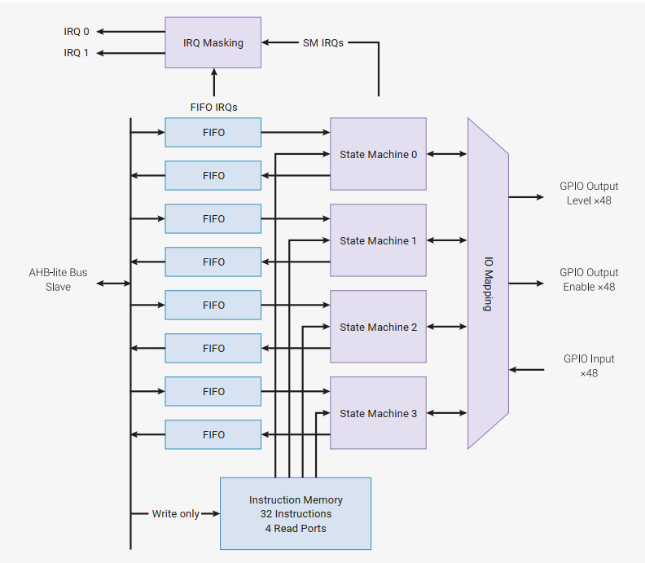

# PIO

可编程输入/输出模块（PIO）是一种多功能的硬件接口，可以支持多种不同的输入输出标准。

每个 PIO 在某种意义上都是可编程的：四个状态机独立执行程序控制 GPIO 并传输数据。与通用处理器不同，PIO 状态机高度专注于 IO，重点在于确定性、精确时序以及与固定功能的硬件紧密集成。每个状态机配备：

- 两个32位移位寄存器——任一方向，任意移位计数
- 两个32位暂存寄存器
- 每个方向（TX/RX）的 4×32 位总线 FIFO，单向可重构为 8×32
- 分数时钟分频器（16整数，8小数比特）
- 灵活的 GPIO 映射
- DMA 接口，系统 DMA 每时钟持续吞吐量可达 1 字
- IRQ 标志设置/清除/状态

